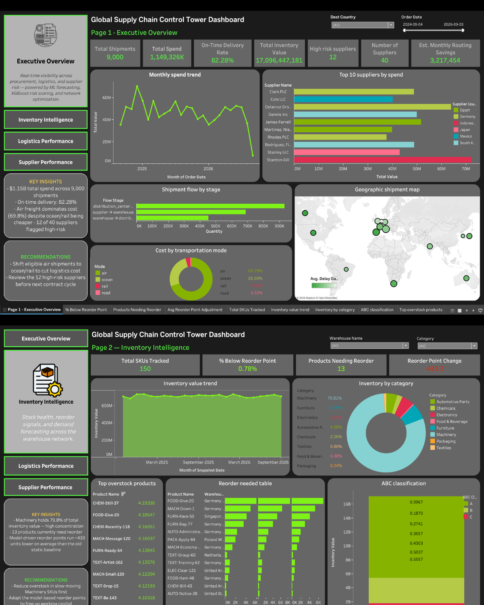
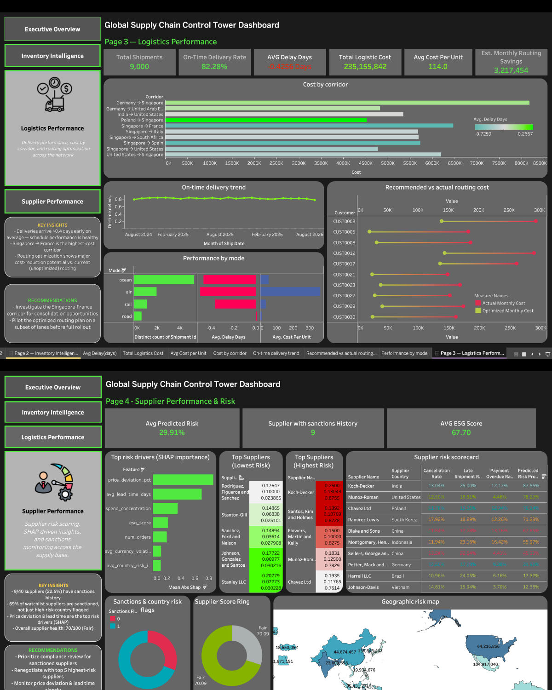

# Global Supply Chain Control Tower

An end-to-end supply chain intelligence platform — demand forecasting,
supplier risk scoring, network resilience analysis, and route optimization,
surfaced through a 4-page interactive Tableau dashboard.

Built as a portfolio project to demonstrate a full analytics pipeline —
data generation → transformation → machine learning → optimization →
decision-ready dashboards — rather than dashboards built directly on raw data.

## Dashboards

**Page 1 — Executive Overview** &nbsp;&nbsp;|&nbsp;&nbsp; **Page 2 — Inventory Intelligence**



**Page 3 — Logistics Performance** &nbsp;&nbsp;|&nbsp;&nbsp; **Page 4 — Supplier Performance & Risk**



## What this project does

Simulates a global supply chain (suppliers → warehouses → distribution
centers → customer regions) — 40 suppliers, 9,000 shipments, $1.15B in
simulated spend — and builds:

- **Demand forecasting** (Prophet) driving dynamic, model-based reorder
  points instead of static thresholds
- **Supplier risk scoring** (XGBoost + SHAP) that explains *why* a supplier
  is high-risk — price deviation and lead-time volatility turned out to be
  the strongest predictors, not the obvious ones
- **Network resilience analysis** (NetworkX) — modeled the full
  supplier→warehouse→distribution→customer network as a graph and ran
  disruption simulations to find real chokepoints
- **Shipment routing optimization** (PuLP) balancing cost against a
  service-level constraint
- **4 interactive Tableau dashboards** where the model outputs — not just
  raw aggregates — drive the visuals directly

## A few honest findings, not just a features list

- Caught a bug where the risk model was performing close to random —
  traced it to a data-generation flaw (Day 3 shipment lateness wasn't
  correlated with supplier risk tier, even though Day 2's cancellations
  were), fixed it, and watched cross-validated AUC improve meaningfully.
- The network showed **zero single points of failure** — a genuine,
  reportable finding about a resilient topology, not a gap to explain away.
  The dashboard instead surfaces the closest thing to a chokepoint: one
  distribution center whose failure would add ~5-6 days of average delay
  across 20 customer regions.
- The routing optimization shows a large cost-reduction number that's
  **not a realistic savings claim** — it's comparing against a randomly
  assigned baseline, not real-world routing. Documented in
  [docs/DECISIONS.md](docs/DECISIONS.md) so the framing isn't lost later.

Every non-obvious decision and trade-off made during the build — including
the two above — is logged in
[docs/DECISIONS.md](docs/DECISIONS.md) as a running technical decisions log.

## Tech stack

**Data & ML:** Python, pandas, NumPy, SDV (synthetic data), Prophet,
XGBoost, SHAP, MLflow, NetworkX, PuLP
**Visualization:** Tableau

## Repo structure

```
.
├── docs/
│   ├── schema.md          # data model reference
│   ├── DECISIONS.md       # running log of technical decisions
│   └── images/            # dashboard screenshots (this README)
├── scripts/
│   ├── generate_day2_data.py    # suppliers, products, POs, invoices, risk signals
│   ├── generate_day3_data.py    # warehouses/DCs/customers, shipments, network edges, inventory
│   ├── build_marts.py           # cleans + joins raw CSVs into analysis-ready marts
│   ├── forecast_demand.py       # Prophet demand forecasting + dynamic reorder points
│   ├── supplier_risk_model.py   # XGBoost + SHAP supplier risk scoring
│   ├── network_disruption.py    # NetworkX graph + disruption simulation
│   └── routing_optimization.py  # PuLP shipment routing optimization
├── data/
│   ├── raw/               # generated synthetic CSVs
│   ├── marts/             # cleaned, joined, analysis-ready CSVs
│   └── models/            # model outputs (forecasts, risk scores, network/routing results)
└── supply_chain_control_tower.twbx   # the Tableau workbook
```

## Setup

```bash
git clone https://github.com/<your-username>/supply-chain-control-tower.git
cd supply-chain-control-tower
pip install pandas numpy faker sdv prophet xgboost shap mlflow networkx pulp
```

## Running the pipeline

Run in order — each stage depends on the previous one's output:

```bash
cd scripts
python generate_day2_data.py     # suppliers, products, POs, invoices, risk signals
python generate_day3_data.py     # nodes, shipments, network edges, inventory
python build_marts.py            # analysis-ready marts + 19 validation checks
python forecast_demand.py        # demand forecasts + dynamic reorder points
python supplier_risk_model.py    # supplier risk model + SHAP explainability
python network_disruption.py     # network graph + disruption simulation
python routing_optimization.py   # routing optimization
```

Outputs land in `data/raw/`, `data/marts/`, and `data/models/`. Open
`supply_chain_control_tower.twbx` in Tableau to explore the dashboards, or
connect a fresh Tableau workbook to the CSVs in `data/marts/` and
`data/models/` directly.

**Note:** country risk index and currency volatility values in
`generate_day2_data.py` are illustrative placeholders, not real published
figures — see [docs/DECISIONS.md](docs/DECISIONS.md) for what to swap in
before treating this as a finished dataset.


## Author

Rashini — final-year BSc (Hons) Computer Science, NSBM Green University
(affiliated with the University of Plymouth)